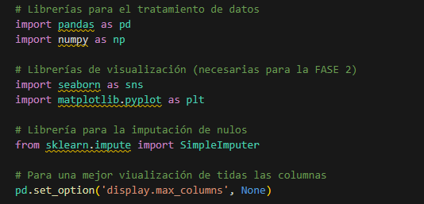
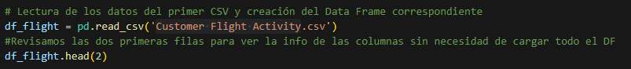
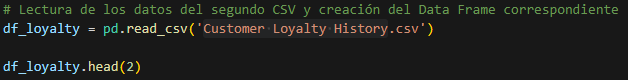

<h1 align="center" id="title"> Airline Loyalty Program EDA</h1> 
<h2 align="center" id="title"> Exploratory Data Analysis of a customer data set within an airline loyalty program. </h2>

  

## INDEX

- [Introduction](#Introduction)
- [Files](#Files)
- [Requirements](#Requirements)
- [The process](#the-process)
  - [Built with](#built-with)
  - [First phase](#First-phase-exploration-and-cleaning)
    - [Importations](#Importing-libraries-and-loading-data)
    - [General](#General-exploration-and-cleaning)
    - [Cleaning](#Data-cleaning)
  - [Secnd phase](#Second-phase-visualization)
- [Author](#author)

## INTRODUCTION

This project focuses on conducting an Exploratory Data Analysis (EDA) on a dataset related to an airline's customer loyalty program. The main objective is to uncover patterns and trends in flight activity and customer loyalty history, which will help inform strategies for improving customer retention and enhancing overall satisfaction. By analyzing various customer variables, we aim to provide actionable insights that can drive data-driven decision-making in the airline industry.
  
## FILES

Files required for project review:

*    Customer Flight Activity.csv: Contains data on customer flight activity.
*    Customer Loyalty History.csv: provides a detailed profile of customers as well as includes data on the customer loyalty program.
*    airline_data.ipynb: Jupyter notebook including exploratory data analysis (EDA).

## REQUIREMENTS

*Make sure you have the following libraries installed in your Python environment:*

1. pandas
2. numpy
3. matplotlib
4. seaborn
5. scikit-learn

If you do not have these libraries, you can install them using *pip install* 

## THE PROCESS 
### Built with

*Technologies used in the project:*

*   Operating system: Windows 10 Home
*   Development Environment: Jupyter Notebook, Visual Studio Code
*   Programming Language: Python
*   Libraries specified above
*   Version Control: Git, GitHub
*   Dependency Management: Pip

### First phase exploration and cleaning

#### Importing libraries and loading data:

*Use of pandas to load CSV files into DataFrames.*

  

  

  

#### 1.1. General exploration and cleaning

*   General review and analysis of data using Pandas functions to obtain information about the structure of the data and basic statistics.
*   Initial exploration of the data to identify potential problems (null values, duplicate values, outliers or missing data).
*   DataFrame joining

#### 1.2. Data cleaning

*   Verification of data consistency and correctness.
*   Treatment of null data.

### Second phase visualization

Study of six real-world questions about the data and their representation through graphs.

## Author

Made with 💜 & 🩸 by [Belén V N](https://github.com/BelenVN)

### 🖖🏽 LIVE LONG AND PROSPER
 
